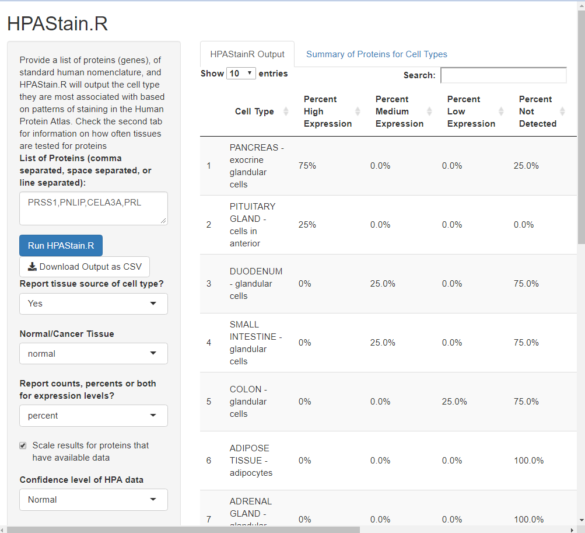

```{r setup, include = FALSE}
knitr::opts_chunk$set(
  collapse = TRUE,
  comment = "#>"
)
```

HPAStainR is a package designed to query the pathologist scored staining data of
multiple proteins/genes at once in the Human Protein Atlas (HPA). This vignette
will walk you through:

  - How to download the data required to run HPAStainR
  
  - How to run HPAStainR as a function
  
  - How to run HPAStainR as a Shiny App

# How to install HPAStainR
Installation can be completed using BiocManager and the code below.
```{r, eval = FALSE}
if(!requireNamespace("BiocManager", quietly = TRUE))
    install.packages("BiocManager")
BiocManager::install("HPAStainR")
```


# Preparing data for HPAStainR

## Downloading data from the website
The first step required to run HPAStainR is downloading HPA's normal tissue
staining data and their cancer data. While available online, HPAStainR has a
function that can download and load the data for you.
```{r, download_data}
library(HPAStainR)

HPA_data <- HPA_data_downloader(tissue_type = "both", save_file = FALSE)
```

The above function has downloaded both normal tissue and cancer data.
`save_file` was set to `FALSE`, but if it were set to `TRUE` as there was no
given argument for `save location`,  both files being saved to the current
working directory. The data has also been unzipped and loaded into the object
HPA_dat as a list of data frames called `hpa_dat` and `cancer_dat` which hold
the normal tissue and cancer tissue data respectively. If the code is run again
it would redownload the files unless you had set `save_file` to `TRUE`, in which
case it would just load said saved files.


### Head of normal tissue 
```{r, echo=FALSE, results='asis', normal_data}
knitr::kable(head(HPA_data$hpa_dat, 10))
```

### Head of cancer tissue (columns 1-7)
```{r, echo=FALSE, results='asis', cancer_data}
knitr::kable(head(HPA_data$cancer_dat[,seq_len(7)], 10))
```


# Using HPAStainR

## Using the HPAStainR function

Now that the data is available you can now us the HPAStainR function. This
requires a list of proteins or genes you are interested in. In this example,
we're going to use pancreatic enzymes PRSS1, PNLIP, CELA3A, and the hormone PRL.
```{r, function_example}
gene_list = c("PRSS1", "PNLIP","CELA3A", "PRL")

stainR_out <- HPAStainR::HPAStainR(gene_list = gene_list,
          hpa_dat = HPA_data$hpa_dat,
          cancer_dat = HPA_data$cancer_dat,
          cancer_analysis = "both",
          stringency = "normal")


head(stainR_out, 10)

```

The output of HPAStainR is a tibble with multiple columns. The basic columns include the following:

  - **cell_type:** The cell types/cancers that are tested in the Human Protein Atlas.
  
  - **percent/count_high/medium/low_expression**: Either the percent or count of genes from the list that stain either at high levels, medium levels or low levels.
  
  - **percent/count_not_detected**: The number or percent of proteins that failed to stain the cell type.
  
  - **number of proteins**: The number of proteins tested in a cell type.
  
  - **tested_proteins**: A character string of proteins that were tested in the cell type as not all proteins are tested in every cell type.
  
  - **detected_proteins**: A character string of proteins that were detected in each cell type.
  - **enriched_score**: An arbitrary ranking value further explained below.
  
  - **p_val**: A p-value denoting an enrichment of rarely staining proteins (stained in <29% of the cell types, see paper [cite] for further details).
  
  - **p_val_adjust**: The previous p-value adjusted for multiple testing using "holm"
  
  
  The **staining score** an arbitrary rank of staining weighted on how highly a protein stained. See the manual for the equation and further information.


# Using the HPAStainR Shiny app

Another way to use HPAStainR is as a [Shiny app](https://32tim32.shinyapps.io/HPAStainR/), and the function shiny_HPAStainR allows you to run a local version of the app:

**Note:**
If you want the tab from the online Shiny that gives you the stained : tested
ratio of proteins, make sure to run the below code and insert the resulting
object in the third argument (`cell_type_data`) of shiny_HPAStainR

```{r, summarydata}
hpa_summary <- HPA_summary_maker(hpa_dat = HPA_data$hpa_dat)
```

## Run the Shiny app
```{r eval=FALSE, shinyapp}
shiny_HPAStainR(hpa_dat = HPA_data$hpa_dat,
                cancer_dat = HPA_data$cancer_dat,
                cell_type_data = hpa_summary)


```
### A window should open like that below

You should now be able to query whatever list of proteins you like and can
easily rank them on whatever column you wish. Also all of the options from the
functions are modifiable on the left hand side panel.


# Session Info
```{r, session_info}
sessionInfo()
```


Any questions? Feel free to contact me at tnieuwe1[@]jhmi.edu